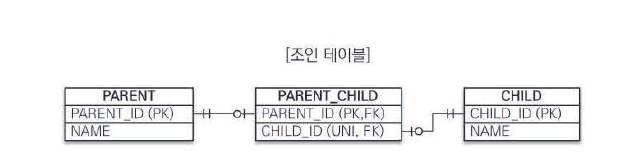
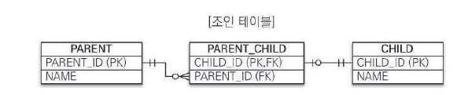
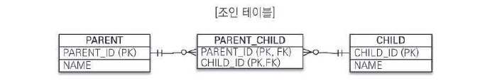

# 7.1 상속 관계 매핑

- JPA 엔티티로 상속 관계를 표현하고 매핑하는 방법은 조인 전략, 단일 테이블 전략, 구현 클래스마다 테이블 전략 총 3가지의 전략이 있다.

<br/>

## 7.1.1 조인 전략

- 부모 클래스와 자식 클래스를 각각의 테이블로 만들고,
- 자식 테이블이 부모 테이블의 ID를 외래 키로 가지는 방식이다.
- DTYPE 컬럼은 자식 테이블들을 구분하는 용도로 사용되는 컬럼이다
- DTYPE 컬럼은 굳이 사용 안해도 된다 그러나 사용이 권장됨
- DTYPE 컬럼은 부모 테이블에만 생성된다.

```java
@Entity
@Inheritance(strategy = InheritanceType.JOINED)
@DiscriminatorColumn(name = "DTYPE")
public abstract class Item {
    @Id @GeneratedValue
    private Long id;
    private String name;
    private int price;
}

@Entity 
@DiscriminatorValue("ALBUM")
public class Album extends Item {
    private String artist;
}

@Entity
@DiscriminatorValue("BOOK")
public class Book extends Item {
    private String author;
    private String isbn;
}
```

- 이렇게 하면 실제 데이터는 다음과 같이 들어가게 된다.

```
[ITEM 테이블]
ID    NAME      PRICE    DTYPE
1     앨범1     10000    ALBUM
2     책1       20000    BOOK

[ALBUM 테이블]
ID    ARTIST
1     BTS      // ID=1인 ITEM과 조인됨

[BOOK 테이블]
ID    AUTHOR    ISBN
2     김작가    12345     // ID=2인 ITEM과 조인됨
```

<br/>

## 7.1.2 단일 테이블 전략

- 자식 엔티티의 필드들이 모두 부모 테이블에 포함되는 방식이다.
- 하나의 테이블에 자식 테이블의 정보들이 모두 있기 때문에 조인을 사용하지 않아도 돼서 성능이 좋음.
- 외래키로 구분되는게 아니라서 DTYPE이 필수이다.
- 주의점으로는 자식 엔티티 컬럼들이 모두 NULL을 허용해야한다는 것
- 오히려 너무 많은 컬럼이 들어가서 조회 성능이 떨어질 경우도 있다.

```java
@Entity
@Inheritance(strategy = InheritanceType.SINGLE_TABLE)
@DiscriminatorColumn(name = "DTYPE")
public abstract class Item {
    @Id @GeneratedValue
    private Long id;
    private String name;
    private int price;
}

@Entity
@DiscriminatorValue("ALBUM")
public class Album extends Item {
    private String artist;
}

@Entity
@DiscriminatorValue("BOOK")
public class Book extends Item {
    private String author;
    private String isbn;
}
```

- 이렇게 하면 실제 데이터는 다음과 같이 들어가게 된다.

```
[ITEM 테이블]
ID   NAME   PRICE   DTYPE   ARTIST   AUTHOR    ISBN
1    앨범1   10000  ALBUM    BTS       null    null    -- Album의 경우
2    책1     20000  BOOK     null     김작가   12345   -- Book의 경우
```

<br/>

## 7.1.3 구현 클래스마다 테이블 전략

- 자식 클래스가 각각의 테이블로 만들어지고, 부모 클래스의 필드들이 자식 테이블에 각각 컬럼으로 들어가게 된다.
- 부모 테이블은 만들어지지 않음!
- 여러 자식 테이블을 조회할 때 UNION을 사용해야하기 때문에 성능이 좋지 않다.
- 여러모로 추천되지 않는 전략이다.

```java
@Entity
@Inheritance(strategy = InheritanceType.TABLE_PER_CLASS)
public abstract class Item {    // 부모 클래스
    @Id @GeneratedValue
    @Column(name = "ITEM_ID")
    private Long id;
    private String name;
    private int price;
}

@Entity
public class Album extends Item {    // 자식 클래스
    private String artist;
}

@Entity
public class Book extends Item {     // 자식 클래스
    private String author;
    private String isbn;
}
```

- 이렇게 하면 실제 데이터는 다음과 같이 들어가게 된다.

```
[ALBUM 테이블]
ITEM_ID   NAME   PRICE   ARTIST
1        앨범1   10000   BTS

[BOOK 테이블]
ITEM_ID   NAME   PRICE   AUTHOR   ISBN
2         책1    20000   김작가    12345
```

<br/><br/>

# 7.2 @MappedSuperclass

- 공통 매핑 정보가 필요할 때 사용되는 어노테이션
- 추상 클래스와 비슷한데, @Entity와 달리 실제 테이블과 매핑되지 않음
  이 어노테이션을 붙인 클래스를 상속 받은 엔티티는, 부모 클래스의 필드들도 자동으로 테이블에 매핑됨
  
<br/>

  예를 들어 모든 테이블에 다음과 같은 공통 컬럼이 필요하다고 가정하자.

- 생성일자
- 생성자
- 수정일자
- 수정자

```java
@Entity
public class Member {
    @Id @GeneratedValue
    private Long id;
    private String name;
    
    private LocalDateTime createdDate;  // 복붙
    private String createdBy;           // 복붙
    private LocalDateTime modifiedDate; // 복붙
    private String modifiedBy;          // 복붙
}

@Entity
public class Board {
    @Id @GeneratedValue
    private Long id;
    private String title;
    
    private LocalDateTime createdDate;  // 복붙
    private String createdBy;           // 복붙
    private LocalDateTime modifiedDate; // 복붙
    private String modifiedBy;          // 복붙
}
```

이렇게 매번 복붙하기 귀찮을 것이다.

이럴 때 @MappedSuperclass로 공통 필드만 뽑아서 상속받아 사용하는 것이다.

```java
@MappedSuperclass
public abstract class BaseTimeEntity {
    // 이 필드들이 모두 상속받은 엔티티 테이블의 컬럼으로 들어가게 된다.
    private LocalDateTime createdDate;
    private String createdBy;
    private LocalDateTime modifiedDate;
    private String modifiedBy;
}

@Entity
public class Member extends BaseTimeEntity {
    @Id @GeneratedValue
    private Long id;
    private String name;
}

@Entity
public class Board extends BaseTimeEntity { 
    @Id @GeneratedValue
    private Long id;
    private String title;
}
```

<br/><br/>

# 7.3 복합 키와 식별 관계 매핑
## 7.3.1 식별 관계 vs 비식별 관계

- 외래 키가 기본 키에 포함되는지에 따라 식별 관계, 비식별 관계로 나뉜다.

- 비식별 관계
```java
@Entity
public class Parent {
    @Id
    @Column(name = "PARENT_ID")
    private String id;
    private String name;
}

@Entity
public class Child {
    @Id
    @Column(name = "CHILD_ID")
    private String id;           // 자신만의 PK
    
    @ManyToOne
    @JoinColumn(name = "PARENT_ID")  // 부모 ID는 FK로만 사용
    private Parent parent;
    
    private String name;
}
```

- 식별 관계
```java
@Entity
public class Parent {
    @Id
    @Column(name = "PARENT_ID")
    private String id;
    private String name;
}

@Entity
public class Child {
    @Id
    @Column(name = "PARENT_ID")  // 부모의 ID를 PK로 사용
    private String parentId;      // 동시에 FK역할
    
    @Id
    @Column(name = "CHILD_ID")   // 자신의 ID와 함께 복합 키 구성
    private String childId;
    
    @ManyToOne
    @JoinColumn(name = "PARENT_ID", insertable = false, updatable = false)
    private Parent parent;
}
```

<br/>

## 7.3.2 복합 키: 비식별 관계 매핑

  기본 키가 하나라면 단순하게 @Id 로 지정해주면 되지만, 복합키의 경우 다음처럼 매핑하면 예외가 발생한다.

```java
@Entity
public class Hello {
    @Id
    private String id1;
    @Id
    private String id2; // 실행 시점에 예외 발생
}
```

  따라서 식별자가 2개 이상인 경우 별도의 식별자 클래스를 만들어 사용해야 하는데,
  
  JPA에서는 복합 키를 지원하기 위해 @IdClass 와 @EmbeddedId 를 제공한다.

우선 비식별 관계는 연관관계로 매핑하거나 상속 받은 자식 엔티티가 부모 엔티티의 기본 키를 외래 키로 사용하는 관계를 의미한다.

@IdClass를 사용하는 경우부터 살펴보자.

```java
// 1. 복합키 클래스
// 반드시 public이어야 하며, Serializable 인터페이스 구현이 필수
public class ParentId implements Serializable {
    private String id1;    // Parent.id1과 매핑
    private String id2;    // Parent.id2와 매핑
    
    // 기본 생성자, equals 및 hashCode 구현이 필수이다.
    public ParentId() {}
    
    @Override
    public boolean equals(Object o) {...}
    
    @Override
    public int hashCode() {...}
}

// 2. 엔티티
@Entity
@IdClass(ParentId.class)
public class Parent {
    @Id
    @Column(name = "PARENT_ID1")
    private String id1;    // ParentId.id1과 매핑
    
    @Id
    @Column(name = "PARENT_ID2")
    private String id2;    // ParentId.id2와 매핑
    
    private String name;
}

// 3. 자식 엔티티
// 만약 복합키를 가진 엔티티를 연관관계로 매핑하거나 상속 받는다면 @JoinColumns로 복합키의 식별자들을 매핑시켜줘야함!
@Entity
public class Child {
    @Id
    @GeneratedValue
    private Long id;
    
    @ManyToOne
    @JoinColumns({
        @JoinColumn(name = "PARENT_ID1", referencedColumnName = "PARENT_ID1"),
        @JoinColumn(name = "PARENT_ID2", referencedColumnName = "PARENT_ID2")
    })
    private Parent parent;
}
```

위와 같이 @IdClass로 복합키 클래스를 지정해주면 엔티티에서 식별자를 여러개(복합키 클래스에 정의된 식별자만) 사용할 수 있다.

다음으로 @EmbeddedId를 사용해보자.

```java
// 1. 복합키 클래스
// 복합키 클래스에 @Embeddable 어노테이션을 붙여줘야함
// 또한 식별자 클래스에서 직접 식별자를 지정해줘야 한다.
@Embeddable
public class ParentId implements Serializable {
    @Column(name = "PARENT_ID1")
    private String id1;
    
    @Column(name = "PARENT_ID2")
    private String id2;
    
    // 기본 생성자 필수
    public ParentId() {}
    
    // equals & hashCode 필수
    @Override
    public boolean equals(Object o) {...}
    
    @Override
    public int hashCode() {...}
}

// 2. 엔티티
@Entity
public class Parent {
    @EmbeddedId
    private ParentId id;
    
    private String name;
}

// 3. 자식 엔티티
@Entity
public class Child {
    @Id
    @GeneratedValue
    private Long id;
    
    @ManyToOne
    @JoinColumns({
        @JoinColumn(name = "PARENT_ID1", referencedColumnName = "PARENT_ID1"),
        @JoinColumn(name = "PARENT_ID2", referencedColumnName = "PARENT_ID2")
    })
    private Parent parent;
}
```

복합키를 사용하고자 하는 엔티티의 식별자 필드 위에 @EmbeddedId만 붙이면 복합키를 식별자로서 사용할 수 있다.

둘의 차이점은 @IdClass는 데이터베이스 관점, @EmbeddedId는 객체 지향 관점이라는 것 정도이다.

취향껏 프로젝트에서 일관성 있게 사용하면 되는 듯하다.

그러나 @EmbeddedId를 사용하는 경우는 특정 상황의 JPQL이 조금 길어지는 단점이 있긴 하다.

<br/>

## 7.3.3 복합 키: 식별 관계 매핑

식별 관계는 부모 테이블(상속 혹은 연관관계 매핑)의 기본 키를 자식 테이블의 기본 키로 사용하는 관계이다.

우선 @IdClass를 쓰는 방식부터 살펴보자.

```java
// 1. Parent (최상위 부모)
@Entity
public class Parent {
    @Id
    @Column(name = "PARENT_ID")
    private String id;      // Parent의 기본키
    
    private String name;
}

// 2. Child의 식별자 클래스
public class ChildId implements Serializable {
    private String parent;  // Parent의 ID
    private String id;      // Child의 ID
    
    // equals & hashCode...
}

// 3. Child (중간 자식)
@Entity
@IdClass(ChildId.class)
public class Child {
    @Id
    @ManyToOne
    @JoinColumn(name = "PARENT_ID")
    private Parent parent;  // Parent의 ID를 PK로 사용
    
    @Id
    @Column(name = "CHILD_ID")
    private String id;     // Child 고유 ID를 PK로 사용
    
    private String name;
}

// 4. GrandChild의 식별자 클래스
public class GrandChildId implements Serializable {
    private ChildId child;  // Child의 복합키
    private String id;      // GrandChild의 ID
    
    // equals & hashCode...
}

// 5. GrandChild (손자)
@Entity
@IdClass(GrandChildId.class)
public class GrandChild {
    @Id
    @ManyToOne
    @JoinColumns({
        @JoinColumn(name = "PARENT_ID"),
        @JoinColumn(name = "CHILD_ID")
    })
    private Child child;    // Child의 복합키를 PK로 사용
    
    @Id
    @Column(name = "GRANDCHILD_ID")
    private String id;      // GrandChild 고유 ID를 PK로 사용
    
    private String name;
}
```

위 예시와 같이 식별관계는 부모 엔티티의 기본 키를 자식 엔티티가 계속해서 기본 키로서 매핑시켜줘야 한다.

다음으로 @EmbeddedId를 사용하는 방식을 살펴보자.

@EmbeddedId를 사용하는 경우, 부모 엔티티와 매핑되는 식별자 클래스에 대해서 @Id 대신 @MapsId 를 붙여 주어야 자식 엔티티에서 기본키로 작동된다.

```java
// 1. Parent (최상위 부모)
@Entity
public class Parent {
    @Id
    @Column(name = "PARENT_ID")
    private String id;
    
    private String name;
}

// 2. Child의 식별자 클래스
@Embeddable
public class ChildId implements Serializable {
    private String parentId;  // Parent의 ID
    private String childId;   // Child의 ID
    
    // equals & hashCode ...
}

// 3. Child (중간 자식)
@Entity
public class Child {
    @EmbeddedId
    private ChildId id;
    
    @MapsId("parentId")    // ChildId.parentId와 매핑
    @ManyToOne
    @JoinColumn(name = "PARENT_ID")
    private Parent parent;
    
    private String name;
}

// 4. GrandChild의 식별자 클래스
@Embeddable
public class GrandChildId implements Serializable {
    @Embedded
    private ChildId childId;  // Child의 복합키
    
    private String grandChildId;  // GrandChild의 ID
    
    // equals & hashCode ...
}

// 5. GrandChild (손자)
@Entity
public class GrandChild {
    @EmbeddedId
    private GrandChildId id;
    
    @MapsId("childId")     // GrandChildId.childId와 매핑
    @ManyToOne
    @JoinColumns({
        @JoinColumn(name = "PARENT_ID"),
        @JoinColumn(name = "CHILD_ID")
    })
    private Child child;
    
    private String name;
}
```


<br/>

## 7.3.4 비식별 관계로 구현

위의 복합키로 식별 관계 매핑하는 예제가 사실 비식별 관계로 간단하게 구현된다는 거를 말해주고 싶은 것 같음

```java
// 부모
@Entity
public class Parent {
    @Id @GeneratedValue
    @Column(name = "PARENT_ID")
    private String id;
    
    private String name;
}

// 자식
@Entity
public class Child {
    @Id @GeneratedValue
    @Column(name = "CHILD_ID")
    private String id;

    private String name;

    @ManyToOne
    @JoinColumn(name="PARENT_ID")
    private Parent parent;
    
}

// 손자
@Entity
public class GrandChild {
    @Id @GeneratedValue
    @Column(name = "GRANDCHILD_ID")
    private String id;
    
    private String name;

    @ManyToOne
    @JoinColumn(name="CHILD_ID")
    private Child child;
}
```

비식별 관계로 매핑을 하면 복합키가 없어지고 더 간결해진다.

<br/>

## 7.3.5 일대일 식별 관계

일대일 식별 관계는 자식 엔티티의 식별자를 부모 엔티티의 식별자로 사용한다. 

따라서 부모 엔티티의 식별자가 복합키가 아니라면 자식 엔티티의 식별자도 복합키로 구성하지 않아도 된다.

```java
//부모
@Entity
public class Board {
    @Id @GeneratedValue
    @Column(name = "BOARD_ID")
    private Long id;
    
    private String title;

    @OneToOne(mappedBy = "board")
    private BoardDetail boardDetail;
    
}

// 자식
@Entity
public class BoardDetail {
    @Id
    private Long boardId;
    
    @MapsId
    @OneToOne
    @JoinColumn(name="BOARD_ID")
    private Board board;

    private String content;
}
```

<br/>

## 7.3.6 식별, 비식별 관계의 장단점

### 식별 관계

- 장점: 부모-자식 관계가 명확하고 계층형 데이터 표현이 자연스럽다.
- 단점: 복합 키가 자식 테이블로 갈수록 점점 늘어나서 복잡해진다. 복합 키를 관리하는 것 자체가 번거롭다.

### 비식별 관계

- 장점: 사실 비식별 관계에서의 복합 키 사용은 대리 키 사용으로 단순화시킬 수 있음. 따라서 단순한 코드 작성이 가능해진다.
- 단점: FK 인덱스가 별도로 필요해지고 부모-자식 관계가 조금 불명확해질 수는 있다.

### 추천 방식

새롭게 프로젝트를 진행한다면 일반적으로 비식별 관계 사용을 추천한다고 한다.

그리고 비즈니스 키를 기본 키로서 사용하는 복합 키 대신 Long 타입의 대리 키를 사용하는 것이 추천된다.

<br/><br/>

# 7.4 조인 테이블

테이블 간 관계는 주로 @JoinColumn 어노테이션을 사용해 관리한다.

그러나 조인 테이블 이라는 연관관계만을 다루는 테이블을 따로 두어 관리하는 경우도 존재한다.

주로 다대다 관계를 다대일, 일대다 관계로 풀어내기 위해 주로 쓰이지만 다른 경우에도 쓰일 수 있다.

조인 테이블을 쓴다면 원래 @JoinColumn 어노테이션을 쓰던 필드를 @JoinTable 어노테이션으로 바꿔주면 된다. 

<br/>

## 7.4.1 일대일 조인 테이블

일대일 연관관계에서 조인 테이블을 만드려면 외래 키 컬럼 각각에 유니크 제약조건을 걸어주면 된다.



```java
// 1. 부모
@Entity
public class Parent {
    @Id @GeneratedValue
    @Column(name = "PARENT_ID")
    private Long id;
    
    @OneToOne
    @JoinTable(name = "PARENT_CHILD",
        joinColumns = @JoinColumn(name = "PARENT_ID"),
        inverseJoinColumns = @JoinColumn(name = "CHILD_ID"))
    private Child child;
}

// 2. 자식
@Entity
public class Child {
    @Id @GeneratedValue
    @Column(name = "CHILD_ID")
    private Long id;
    private String number;

    //양방향으로 매핑한다면 추가
    @OneToOne(mappedBy = "child")
    private Parent parent;
}
```

<br/>

## 7.4.2 일대다 조인 테이블

일대다 연관관계에서 조인 테이블을 만드려면 다(N) 쪽의 외래 키 컬럼인 CHILD_ID에 유니크 제약조건을 걸어주면 된다.



```java
// 1. 부모
@Entity
public class Parent {
    @Id @GeneratedValue
    @Column(name = "PARENT_ID")
    private Long id;

    @OneToMany
    @JoinTable(name = "PARENT_CHILD",
        joinColumns = @JoinColumn(name = "PARENT_ID"),
        inverseJoinColumns = @JoinColumn(name = "CHILD_ID"))
    private List<Child> children;
}

// 2. 자식
@Entity
public class Child {
    @Id @GeneratedValue
    @Column(name = "CHILD_ID")
    private Long id;

    private String name;
    
}
```

<br/>

## 7.4.3 다대일 조인 테이블

다대일 관계에서의 조인 테이블은 일대다 관계에서 방향만 반대이므로 테이블 그림은 일대다 관계에서의 그림과 동일하다.

```java
// 1. 부모
@Entity
public class Parent {
    @Id @GeneratedValue
    @Column(name = "PARENT_ID")

    private String name;

    @OneToMany(mappedBy="parent")
    private List<Child> children;
}

// 2. 자식
@Entity
public class Child {
    @Id @GeneratedValue
    @Column(name = "CHILD_ID")      
    private Long id;

    private String name;

    @ManyToOne(optional = false)
    @JoinTable(name = "PARENT_CHILD",
        joinColumns = @JoinColumn(name = "CHILD_ID"),
        inverseJoinColumns = @JoinColumn(name = "PARENT_ID"))
    private Parent parent;
}
```

<br/>

## 7.4.4 다대다 조인 테이블

다대다 조인 테이블은 두 컬럼을 합해서 하나의 복합 유니크 제약조건이 걸려야 한다.

그러면 자연스럽게 두 엔티티의 ID로 복합 기본키가 구성된다.



```java
// 1. 부모
@Entity
public class Parent {
    @Id @GeneratedValue
    @Column(name = "PARENT_ID")
    private Long id;

    private String name;

    @ManyToMany
    @JoinTable(name = "PARENT_CHILD",
        joinColumns = @JoinColumn(name = "PARENT_ID"),
        inverseJoinColumns = @JoinColumn(name = "CHILD_ID"))
    private List<Child> children = new ArrayList<>();
}

// 2. 자식
@Entity
public class Child {
    @Id @GeneratedValue
    @Column(name = "CHILD_ID")
    private Long id;    

    private String name;
}
```

<br/><br/>

## 7.5 엔티티 하나에 여러 테이블 매핑

@SecondaryTable 어노테이션으로 여러 테이블을 매핑시킬 수 있다(잘 사용하지는 않는다).

```java
@Entity
@Table(name = "BOARD")
@SecondaryTable(name = "BOARD_DETAIL",
    pkJoinColumns = @PrimaryKeyJoinColumn(name = "BOARD_DETAIL_ID")
)
public class Board {
    @Id @GeneratedValue
    @Column(name = "BOARD_ID")
    private Long id;

    private String title;

    @Column(table = "BOARD_DETAIL")
    private String content;
}
```

위와 같이 구성하면 BOARD 엔티티에는 BOARD 테이블, BOARD_DETAIL 테이블이 매핑된다.

특히 @Column(table = "BOARD_DETAIL") 어노테이션을 통해 content 필드를 BOARD_DETAIL 이라는 특정 테이블에 컬럼으로 매핑시킬 수 있다. 

더 테이블을 많이 매핑하고 싶다면 @SecondaryTables 어노테이션을 사용하면 된다.

```java
@Entity
@SecondaryTables({
    @SecondaryTable(name = "BOARD_DETAIL"),
    @SecondaryTable(name = "BOARD_FILE")}
)
```

그러나 이렇게 테이블을 많이 매핑시키게 되면

BOARD 테이블을 조회할 때 항상 매핑된 모든 테이블을 조회해야 하기 때문에 성능상에 문제가 발생한다.

따라서 한 테이블에 여러 테이블을 매핑시키는 것 보단, 테이블당 엔티티를 따로 만들어서 일대일 매핑을 하는 것이 권장된다.